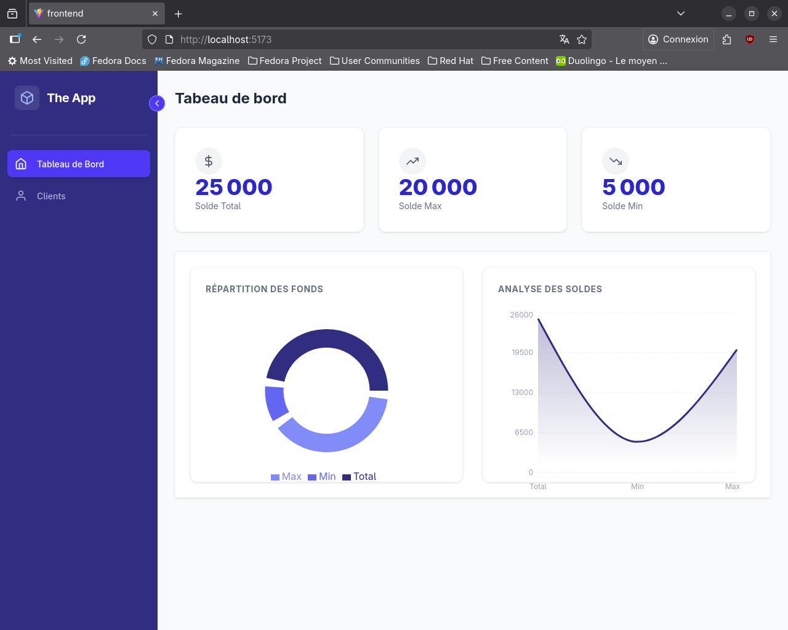
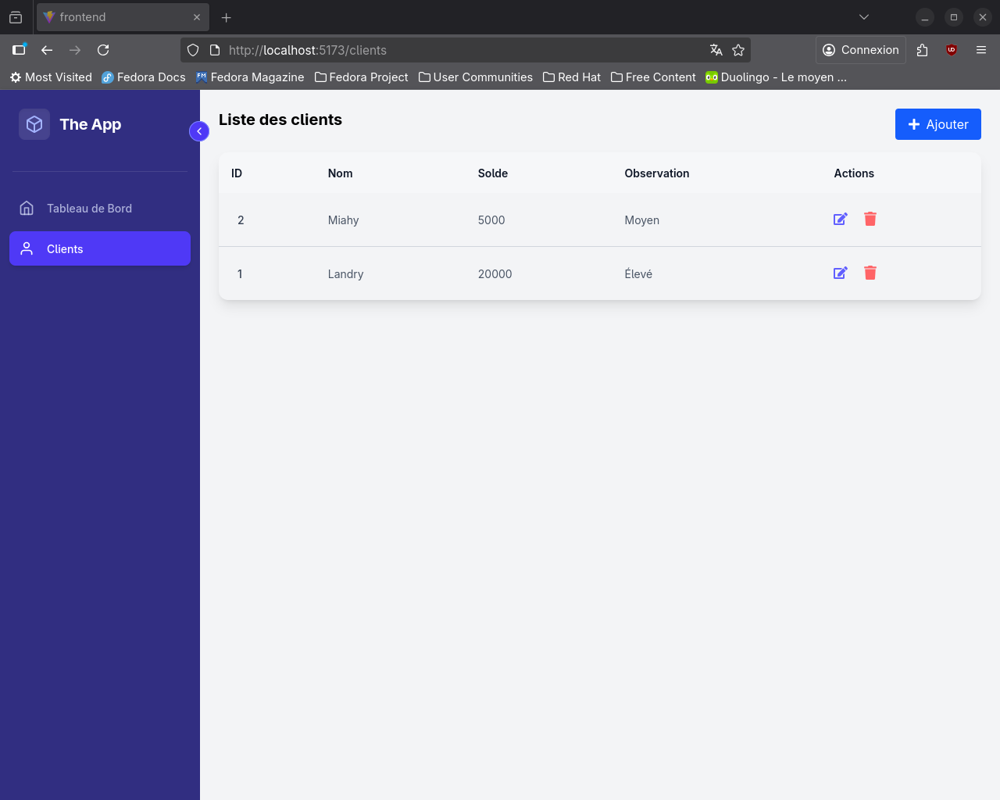
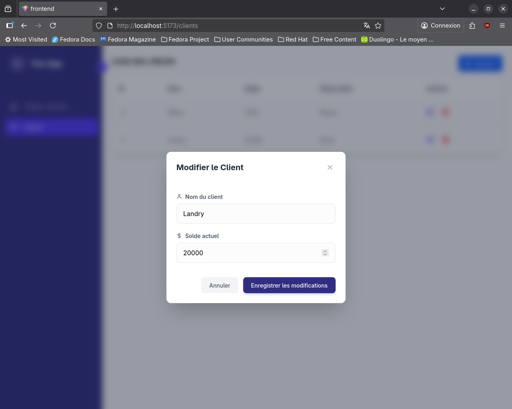
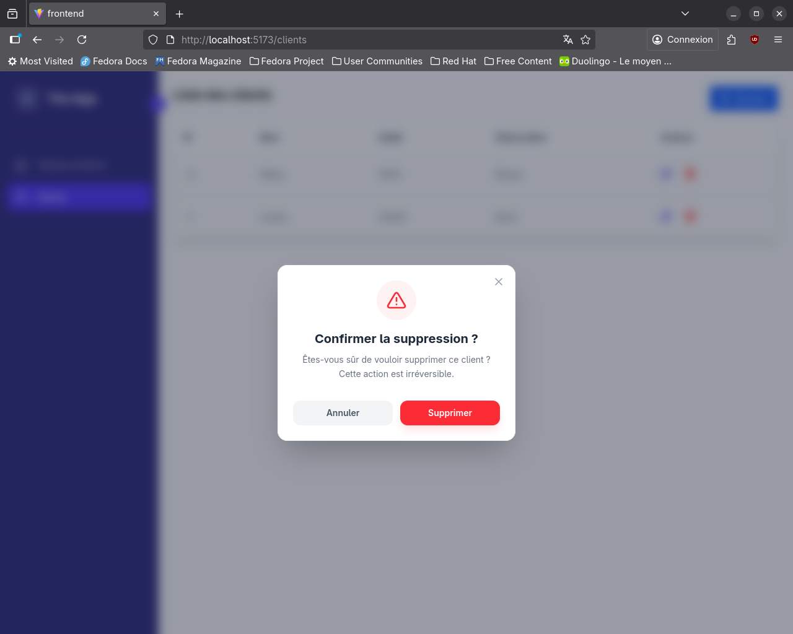

# Client Balance Management App

Application web full-stack pour la gestion des soldes clients avec un tableau de bord moderne et simple.

---

## 🚀 Technologies utilisées

### Frontend
- React.js
- Tailwind CSS
- Axios
- React Router
- Recharts
- React Icons

### Backend
- Node.js
- Express.js
- Sequelize ORM

### Base de données
- PostgreSQL

---

## ✨ Fonctionnalités

- Dashboard avec :
  - Solde total
  - Solde maximum
  - Solde minimum
- Graphiques statistiques
- Gestion des clients :
  - Ajout
  - Modification (modal)
  - Suppression (confirmation)
- Notifications (succès / erreur)
- Interface responsive et moderne

---

## 📸 Aperçu de l'application

### Dashboard


### Liste des clients


### Modification d’un client


### Suppression d'un client

---

## ⚙️ Installation et configuration

2️⃣ Configuration du backend

cd backend
npm install

Créer un fichier .env :
Lancer le serveur :

npm run dev

4️⃣ Configuration du frontend

cd ../frontend
npm install
npm run dev

🧪 Données de test

Assure-toi que PostgreSQL est actif et que la base existe.

👤 Auteur

Développé par Landry
Projet React + Express + PostgreSQL

---
### 1️⃣ Cloner le projet
```bash
git clone [https://github.com/Landry726/Projet-Node-js.git](https://github.com/Landry726/Projet-Node-js.git)
cd Projet-Node-js
